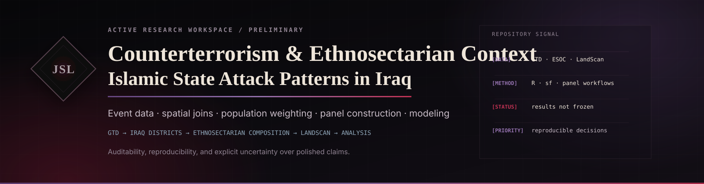

<p align="center">
  
</p>

<p align="center">
  <a href="https://lystadjs.github.io/"><strong>Portfolio</strong></a>
  &nbsp;·&nbsp;
  <a href="https://lystadjs.github.io/research.html"><strong>Research</strong></a>
  &nbsp;·&nbsp;
  <a href="https://lystadjs.github.io/code.html"><strong>Code & Development</strong></a>
  &nbsp;·&nbsp;
  <a href="CITATION.cff"><strong>Citation</strong></a>
  &nbsp;·&nbsp;
  <a href="REPRODUCIBILITY.md"><strong>Reproducibility</strong></a>
</p>

> **Status:** Active research workspace · **Primary language:** R · **Results:** Preliminary / not a frozen publication release

This repository contains reproducible analytical workflows for studying **Islamic State-linked attack patterns in Iraq alongside district-level ethnosectarian context**. It integrates event data, spatial boundaries, ethnicity information, population weighting, diagnostic checks, model objects, and publication-oriented visualizations.

The repository is intentionally transparent about uncertainty and development state. **Code, figures, and derived artifacts should not be interpreted as final empirical claims unless they are tied to a tagged release or an accompanying publication.**

## Research questions

The current analytical program is organized around questions such as:

- How are Islamic State-linked attacks distributed across Iraqi districts with different ethnosectarian compositions?
- How do attack frequency and targeting composition vary across demographic contexts and conflict phases?
- How sensitive are substantive patterns to spatial joins, population weighting, event classification, and missing-data decisions?

## Representative output

<p align="center">
  
</p>

The figure above is included as a **representative analytical output**, not as a standalone final result. Interpretation depends on the underlying sample construction, spatial joins, population weighting, and event-classification decisions documented in the code and supporting files.

## Analytical workflow

```text
external source data
        ↓
raw-file indexing + import
        ↓
schema / duplicate / missingness audit
        ↓
controlled cleaning and type conversion
        ↓
GTD event classification + Iraqi spatial transformation
        ↓
LandScan population-weighted ethnosectarian composition
        ↓
spatial/event joins + district-month analytical panels
        ↓
models + diagnostics + publication-oriented figures
```

The project deliberately exposes dictionaries, diagnostics, intermediate objects, and legacy work where they help reconstruct analytical decisions.

## Repository structure

| Path | Purpose |
|---|---|
| `analysis/` | Canonical high-level analytical entry points |
| `scripts/` | Modular import, validation, cleaning, transformation, and helper functions |
| `data/dictionary/` | Data schemas and variable dictionaries |
| `data/intermediate/` | Intermediate analytical objects retained for auditability |
| `data/processed/` | Derived analytical datasets currently tracked in the project |
| `data/review/` | Review-oriented derived files used during event classification |
| `data/raw/` | Local source-data location; source data are intentionally not committed by this refactor |
| `figures/` | Canonical analytical figures |
| `models/` | Saved model objects |
| `logs/` | Reproducibility and file-index logs |
| `archive/legacy/` | Earlier root-level scripts and duplicate outputs preserved without presenting them as canonical |
| `assets/` | Repository presentation assets |

See [`PROVENANCE.md`](PROVENANCE.md) for the exact structural mapping from the pre-refactor repository.

## Canonical entry points

### 1. Project setup

```r
source("scripts/00) Project Setup.R")
```

This checks the core package set, creates expected project directories, defines common missing-value tokens, and sets the project seed to `1501211`.

### 2. General data-initialization pipeline

```r
source("scripts/25) Data Initialization Pipeline.R")
```

This ties together the modular import, audit, missingness, schema, and export scripts. It is a general initialization pipeline and should be reviewed against the specific source files being used before execution.

### 3. Population-weighted district-month analysis

```r
source("analysis/01_population_weighted_heatmap.R")
```

This workflow validates required GTD, Iraqi spatial/ethnicity, and LandScan inputs; builds quality-control products; constructs a population-weighted district-level ethnicity table; and produces district-month analytical outputs and figures.

### 4. Targeting-composition dashboard

```r
source("analysis/02_targeting_composition_dashboard.R")
```

This script is **not currently standalone**. It expects upstream observed-composition and model-prediction objects to exist in the active R session. That dependency is kept explicit rather than hidden; see [`analysis/README.md`](analysis/README.md).

## Data provenance and redistribution

The workflows reference external sources including:

- **Global Terrorism Database (GTD)** event data;
- Iraqi district and ethnicity spatial materials associated with **ESOC** resources; and
- **LandScan 2008** population data.

External datasets may have separate licenses, EULAs, citation requirements, or redistribution restrictions. Public visibility of this repository does **not** relicense third-party data. See [`DATA.md`](DATA.md) and [`RIGHTS.md`](RIGHTS.md) before redistributing any source or derived material.

## Reproducibility

The repository contains extensive data-quality and provenance machinery, but this development branch does **not fabricate an `renv.lock` from an unknown environment**. A lockfile should be generated from a known-good environment after the canonical workflow is verified end-to-end.

Current reproducibility controls include:

- deterministic project seed (`1501211`);
- explicit source-file validation in the population-weighted workflow;
- raw-file indexing;
- schema inventories and data dictionaries;
- duplicate, missingness, and spatial diagnostics;
- saved intermediate/model objects; and
- retained legacy scripts for provenance.

See [`REPRODUCIBILITY.md`](REPRODUCIBILITY.md) for environment and execution guidance.

## Citation

A [`CITATION.cff`](CITATION.cff) file is included so GitHub can surface repository citation metadata. When this work materially contributes to research, cite the **specific repository version or commit** used and separately cite the underlying datasets according to their source requirements.

## Rights and reuse

No blanket open-source license is asserted by this refactor. Repository code, written material, figures, derived data, and third-party source materials can have different rights requirements. [`RIGHTS.md`](RIGHTS.md) documents the current conservative position until a deliberate licensing decision is made.

## Research integrity

This repository is organized around four principles:

1. **Auditability** — intermediate decisions should be reconstructable.
2. **Reproducibility** — execution requirements and data dependencies should be explicit.
3. **Separation of canonical and legacy work** — historical scripts are retained without being presented as current entry points.
4. **No result inflation** — exploratory or evolving outputs are not described as settled findings.

---

**John S. Lystad**  
[Website](https://lystadjs.github.io/) · [Research](https://lystadjs.github.io/research.html) · [Code & Development](https://lystadjs.github.io/code.html) · [GitHub](https://github.com/LystadJS)
